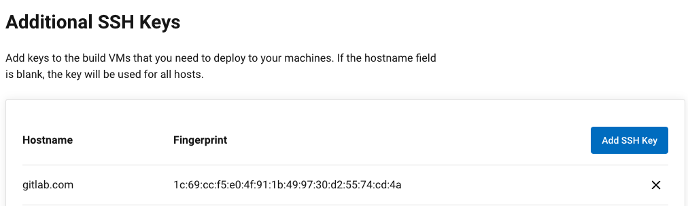
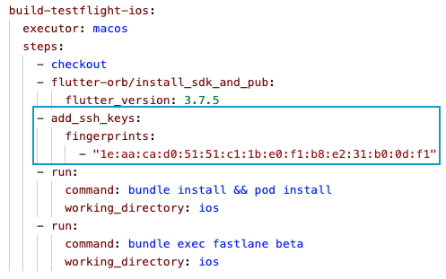

# Flutter CI/CD

Table of Contents
- [Flutter CI/CD](#flutter-cicd)
  - [Preamble](#preamble)
  - [First try with GitLab CI](#first-try-with-gitlab-ci)
  - [Then get stuff done with CircleCI](#then-get-stuff-done-with-circleci)
  - [Pipeline flow](#pipeline-flow)
  - [Deep dive into Fastlane on each platform](#deep-dive-into-fastlane-on-each-platform)
    - [iOS](#ios)
    - [Android](#android)
  - [Trigger pipelines](#trigger-pipelines)
  - [Output log](#output-log)
  - [Secure secret files](#secure-secret-files)


## Preamble
TL;DR -> Follow full example files at [this folder](./example/)

The first time immersed in CI/CD for Flutter? Maybe you're like me, found pretty much solutions and don't know where to start

This article maybe helps.

Topic includes:
- Building app.
- Code signing.
- Distribute through Firebase & Store market.
- Including all real example config files.

My final solution is CircleCI + Fastlane. Why?
- CircleCI has a Free plan that includes macOS instance.
- Fastlane has many useful tools, from building to distributing the app.

There are many different solutions, and if you are new and don't know which way to go, for me the best approach is take CircleCI docs, and it will lead you to other related documents as needed.

Notice that the document in CircleCI is pointed to Android/iOS native, so in their example, some syntax you need to change the current working directory.


## First try with GitLab CI
*My [./gitlab-ci.yml](./gitlab-ci.yml) at that time*

Our project uses GitLab, and I think I'll try GitLab CI/CD.
<br>
GitLab shared runner for the Free plan doesn't provide macOS instances, so I can only build Android.
<br>
Let try Flutter iOS command and soon you will see an error similar this:


It simply means that you cannot run commands that depend on the macOS environment on non-macOS devices.
<br>
Then I try to think about using Mac Docker (macOS VM) but it seems to be not a good perf, and the image size for these is quite large.
<br>
So I have to find another solution.

## Then get stuff done with CircleCI
*Refer my [.circleci/config.yml](./example/.circleci/config.yml) example file.*

Building a Flutter app is actually building a native Android & iOS app.
<br>
So you can build a Flutter app by Flutter command or native command
- Flutter:
  - Android `flutter build appbundle`
  - iOS `flutter build ipa`
- Native: 
  - Android `gradlew assembleDebug`
  - iOS `xcodebuild -project YourProject.xcodeproj -scheme YourScheme -archivePath /Path/To/Output/YourApp.xcarchive archive`

It means with only .circleci/config.yml file, you can use Flutter command to build both for iOS and Android without using Fastlane, like [this](./circleci-basic.yml)

But I'm not sure about more complex operations like code signing for iOS, or distributing to GooglePlay/AppStore with only config.yml file, so the flow is
- On .circleci/config.yml, use Flutter command to run some miscellaneous tasks like install Flutter SDK, pub get, unit test...
- Then go fastlane folder on each platform to build & deploy the app (using native command).
- Fastlane is not only for CI (which I think at first) but can also build and deploy from a local machine. When remote CI has problems, team members can use their local computers to build & deploy apps to ensure consistency.

The folder structure will look like this:
<br>


## Pipeline flow
The order of execution is as follows
- An event is created (push, merge request...) on GitLab
- GitLab webhook (was issued when creating/connecting your GitLab project to CircleCI)<br>
  
  <br>
  ...invoke CircleCI
  <br>
  
- CircleCI is triggered, execute workflow in .circleci/config.yml<br>
  
- When the pipeline is finished<br>
  
  <br>
  ...the result will be sent to Gitlab
  <br>
  

In this example, I'll config 2 env (dev & prod)
- branch dev -> com.duytq.example.dev -> dev config (base api url, app name, tracking config...)
- branch main -> com.duytq.example -> production config 

Diagram overview


## Deep dive into Fastlane on each platform

### iOS
The first and most difficult thing to deal with is code signing, let's use Fastlane Match, following the Fastlane Match official docs and your git Match repo will be similar look like this:
<br>

<br>
Maybe you have 2 provisioning adhoc (dev & production) and 2 provisioning appstore (dev & production) is fine, just in my defined pipeline case, I only need adhoc (dev) & appstore (production).
- Certificate
  - development (to run project on real device)
  - distribution (build archive & distribute it)
- Provisioning
  - adhoc for dev env (com.duytq.example.dev)
  - appstore for production env (com.duytq.example)
  - development for dev env
  - development for production env

If you go to Apple Developer dashboard, the corresponding cert & provisioning have been generated by Match


<br>


(Besides that, having some other solutions like Encode Certificate (.p12) and Provisioning (.mobileprovision), save them to CircleCI Contexts like this [article](https://m4rr.medium.com/circleci-2-0-and-the-ios-code-signing-df434d0086e2). But when I decode to get them back, I stuck on an error, and this is the old way, not recommended by CircleCI, so I'm not sure these work)
<br>


Next step is config to grant CircleCI access git Match repo (at Matchfile), so it can fetch cert & provisioning to build the app.
- First I follow [this](https://circleci.com/docs/ios-codesigning/#adding-a-user-key-to-the-circleci-project) but seems it only works with GitHub, and my project connects with GitLab, so the button "Add User Key" won't work.


- Then I try `match(git_basic_authorization: '<YOUR BASE64 KEY>')` and even though I pass exact the value key, Match still can't fetch the repo (maybe with GitLab, some method not working)

<br>


- In the end, I can solve this with `Add SSH key`. Project Settings -> SSH Keys -> Add SSH Key. Pass the Hostname (gitlab.com) & Private Key (your private ssh key which can access Match repo)

<br>
Notice that we need to specify which ssh key will use (in cases you have multiple ssh keys in CircleCI project settings - usually at least 2, one for default when you connect git project, one for the one just added)


Finally, go to App Store Connect and generate the .p8 key file, which needed to upload ipa to TestFlight through App Store Connect API
<br>
Refer my [./ios/fastlane/](./example/ios/fastlane/) example folder then you'll done.


### Android

With code signing for Android case, I push keystore (.jks) files to git, it's not recommended but for the sake of simplicity in this article, I'll follow this way, whenever CI loads the source code, it already includes the necessary key files.

Follow this video https://youtu.be/Ls2wkAwXftk to generate the .json key file, which is needed to upload aab/apk to Play console through Google Play Android Developer API.<br>
When json key was generated, remember back to Play Console and grant this key appropriate permission, if not we'll get this error


Refer my [./android/fastlane/](./example/android/fastlane/) example folder then you'll done.


## Trigger pipelines

On CircleCI Dashboard, go Project Settings -> Triggers -> Add Trigger then custom this trigger.
<br>
In my case, I would like to build branch dev/main when they are merged from a merge/pull request
```json
{
  "and": [
    {
      "or": [
        {
          "equal": {
            "git/branch": "main"
          }
        },
        {
          "equal": {
            "git/branch": "dev"
          }
        }
      ]
    },
    {
      "equal": {
        "circleci/event_type": "merge_request"
      }
    }
  ]
}
```

Notice that we should have `"circleci/event_type": "merge_request"`, if not, when a PR is merged, the pipeline will run duplicate like below:


Then set the `workflows` at .circleci/config.yml to orchestrate jobs<br>


Acutally you can ignore Add Trigger at CircleCI Dashboard (means doesn't check any branch or action type), because using `workflows` is enough.
<br>
When CircleCI triggers your job, if it does not match any filters condition, no job will be executed like this
<br>


Another common use case to trigger pipeline is when a PR is opened, it needs to pass test, before enable merge button.
<br>
At that time, we should just execute flutter test command without executing fastlane command.


## Output log
Example output logs, please view these files:
- iOS:
  - [bundle exec fastlane adhoc](./output/fastlane-ios-adhoc.txt)
  - [bundle exec fastlane beta](./output/fastlane-ios-beta.txt)
- Android:
  - [bundle exec fastlane adhoc](./output/fastlane-android-adhoc.txt)
  - [bundle exec fastlane beta](./output/fastlane-android-beta.txt)


## Secure secret files
You can store secret files (like p8, json key, token...) to CircleCI Environment Variables.

Or put them in environment variables, then load them from .env file, and make them more secure by using the dedicated secret manager, like Vault by HashiCorp or Secret Manager by Google Cloud.

